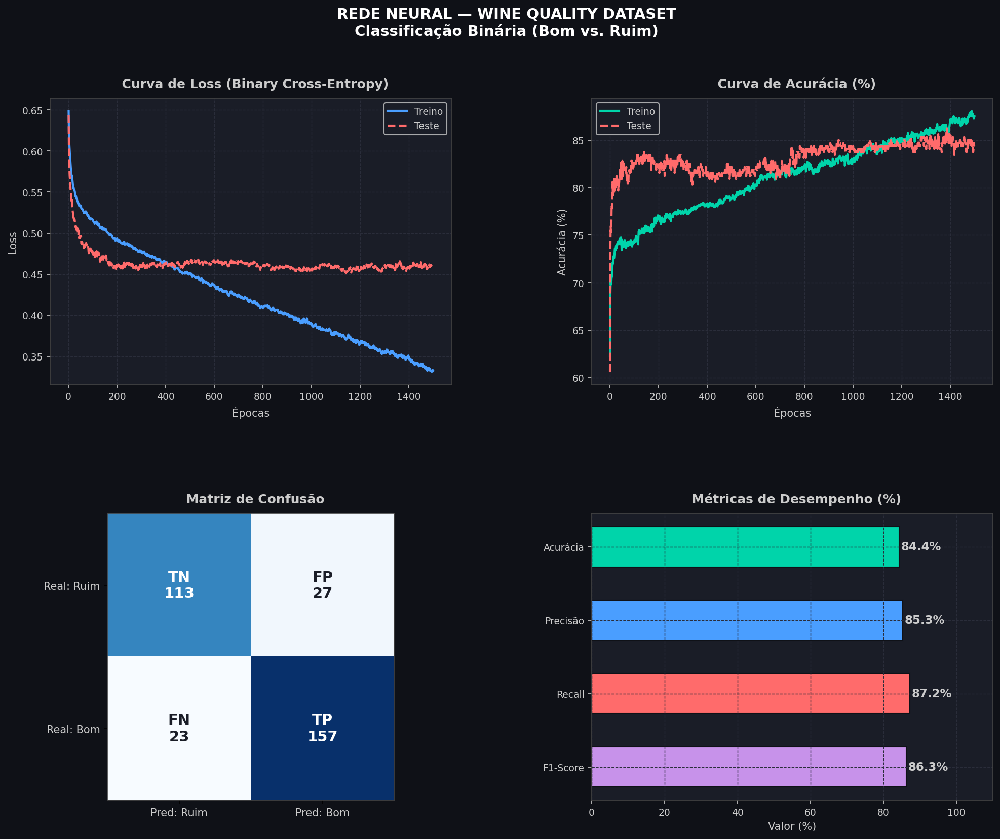

# 🍷 Wine Quality Classifier — Rede Neural do Zero

Classificador binário de qualidade de vinhos construído **do zero**, sem frameworks de deep learning. Implementação completa de uma rede neural utilizando apenas **NumPy**, **Pandas** e **Matplotlib**.

---

## 📌 Objetivo

Prever se um vinho é de **boa ou má qualidade** com base em suas propriedades físico-químicas, utilizando uma rede neural implementada manualmente — incluindo forward pass, backpropagation e atualização de pesos.

---

## 📊 Dataset

- **Fonte:** [Wine Quality Dataset — Kaggle](https://www.kaggle.com/datasets/joebeachcapital/wine-quality)
- **Planilha utilizada:** winequality-red.csv
- **Amostras:** 1.599 vinhos (tintos)
- **Features:** 11 atributos químicos (acidez, pH, teor alcoólico, etc.)
- **Target:** Qualidade binária — `1` (boa) / `0` (ruim), gerada a partir da nota original (0–10)

---

## 🏗️ Arquitetura da Rede

```
Camada de Entrada   →   11 neurônios (features)
Camada Oculta 1     →   64 neurônios  (ReLU)
Camada Oculta 2     →   32 neurônios  (ReLU)
Camada de Saída     →    1 neurônio   (Sigmoid)
```

- **Loss:** Binary Cross-Entropy
- **Otimização:** Gradient Descent com backpropagation manual
- **Implementação:** 100% NumPy — sem Scikit-Learn, TensorFlow ou PyTorch

---

## 📈 Resultados



---

## 🛠️ Tecnologias


---

## 🚀 Como executar

1. Abra o notebook no Google Colab:

[](https://colab.research.google.com/drive/1mN2dMMxYecKd-sWeE69PLV50JZfUfZOn)

---

## 📁 Estrutura do Repositório

```
wine-quality-classifier/     ← nome do repositório
├── Projeto_Rede_Neural_FINAL.ipynb           ← seu notebook do Colab
├── winequality-red.csv          ← o arquivo do dataset
├── results.png              ← a imagem dos gráficos
└── README.md                ← o arquivo que estamos montando
```

---

## 📚 Contexto

Projeto desenvolvido como trabalho acadêmico no curso de **Ciência da Computação**. O objetivo foi compreender o funcionamento interno de redes neurais implementando cada etapa manualmente, sem o uso de bibliotecas de alto nível.
